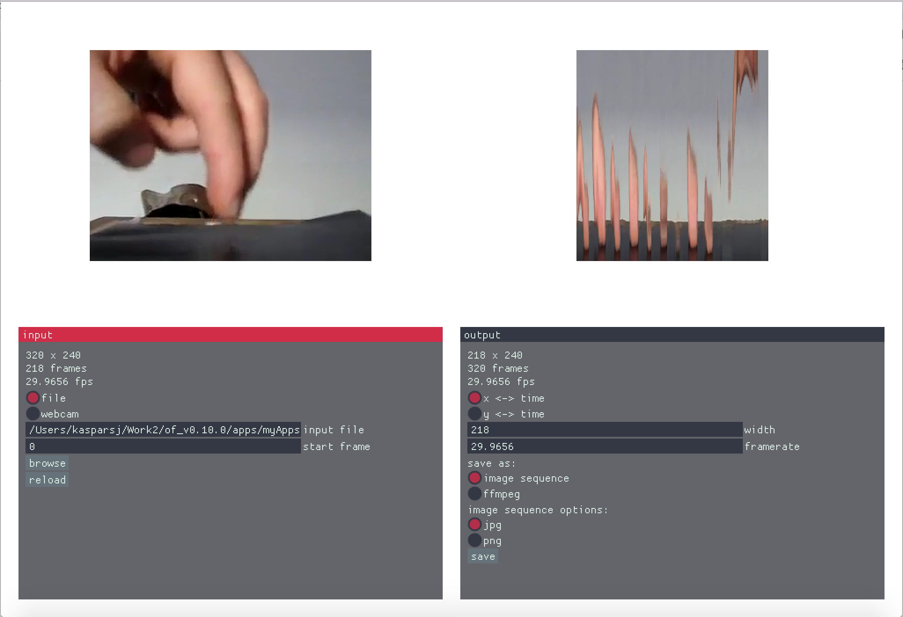

# videoXTime
Rotate a video in 3D by swapping X/Y axis and time. The result is somewhat similar but different to slit-scan.

As an example see this experimental video: https://vimeo.com/316148251

Download macOS and Windows x64 binaries from releases.

Written in C++ using openFrameworks.

